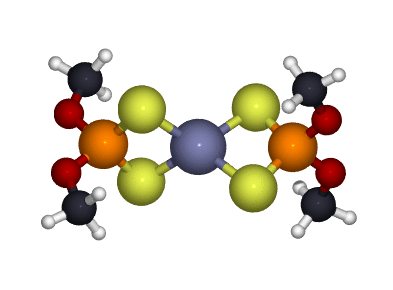

# IR-Raman
xPhon is a small Python package for the calculation of phonon modes, infrared and Raman spectra of molecules using DFPT in VASP.

Note that Only zone-center (Γ-point) frequencies are calculated (q=0 phonons), since VASP does not support non-Γ-point phonons, and therefore this code only works for molecules or systems for which phonon dispersion is irrelevant.

Inspired by the scripts [VASP_tools](https://github.com/sebnenon/VASP_tools) (IR) and [raman-sc/VASP](https://github.com/raman-sc/VASP) (Raman). \
The [ASE](https://wiki.fysik.dtu.dk/ase/) library is used for reading/writing VASP files.

Installation
----
First, clone the repository in your local machine with:

`git clone https://github.com/Enry99/IR-Raman`

Once the download is completed, go inside the downloaded folder and run:

`bash install.sh`

and

`source ~/.bashrc`

to add the executable in the `PATH` variable. With this operation, you can launch the program from any folder.

Finally, if you do not have it already, you need to install [ASE](https://wiki.fysik.dtu.dk/ase/) 3.23 with:

`pip install ase==3.23.0`

The help of the program can be displayed with

`$ xphon -h`

The help for the sub-commands can be visualized by placing `-h` after the command, e.g.:

`$ xphon plot -h`

Usage
----

In order to run IR and Raman calculations, you need the following input files in the working directory:
- INCAR
- POSCAR
- KPOINTS
- POTCAR
- settings.json

The INCAR file should contain the following tags:

    EDIFF = 1E-10    ! or anyway a very low value
    PREC = Accurate
    NELMIN = 10      ! or higher

    ISMEAR = 0       ! you can use other smearing methods, but Gaussian is usually good for molecules
    SIGMA = 0.01     ! or any small value

    ISYM = 0

    LCHARG = .FALSE. !(to avoid producing hundreds CHGCAR files in Raman calculations)
    LWAVE = .FALSE.  !(to avoid producing hundreds of heavy WAVECAR files in Raman calculations)

Note that a high ENCUT is usually suggested for phonon calculations.

Warning: DO NOT include specifig tags for phonons/dielectric tensor calculations, such as `IBRION` or `LEPSILON`, as they are automatically appended to the INCAR by this program.

The settings.json file should contain these keys:

    "step_size": 0.01,
    "jobscript_path": "path/to/your/jobscript.sh",
    "submit_command": "sbatch"

Workflow:
1) First, you need to run a phonon calculation with VASP, which also gives the IR spectrum.

   `$ xphon ir`

This will submit a single VASP DFPT calculation for all phonon modes, calculating also the dielectric tensor for the equilibrium structure.

2) Then you need can run the Raman calculations (in parallel):

    `$ xphon raman`

This will submit a large number of calculations (6N, where N is the number of atoms), corresponding to displacements +dx and -dx (dx=step size) along the eigenvector of each mode. For each displacement, the dielectric tensor is computed, so that the derivative of the dielectric tensor for every mode can be calculated with finite difference from the two displacements.

If your scheduler does not allow to submit all jobs in parallel, simply wait for the first batch to finish and repetedly launch `$ xphon raman` until all calculations are completed (only the missing calculations are submitted, the completed ones will be kept).

Only for SLURM scheduler, you can cancel all the submitted jobs with the command:
    $ xphon scancel

Postprocessing
---

To get the spectra, use the following commands:

    $ xphon write ir
    $ xphon write raman

After writing, you can plot the spectra using the following commands:

    $ xphon plot ir
    $ xphon plot raman

You can choose the type of broadening with the option `-broaden`, e.g:

 `$ xphon plot ir -broaden gauss `

 or

 `$ xphon plot ir -broaden lorentz `

The FWHM of the broadening can be specified with `-fwhm` (default 10 cm-1)

Only for Raman spectra you can correct the intensity with a prefactor depending on the Bose-Einstein distribution at the energy of the mode and a correction for the laser frequency. To apply this correction, use e.g.:

`-laser-freq 12700` (in cm-1).

 You can specify the temperature for the Bose-Einstein factor with

 `-temperature 300` (default 300).

Especially when applying this corrective factor, which goes to infinity for freq -> 0, it is useful to exclude the low-frequency region of the plot. This can be done with the `-range` option, e.g.

`-range 100 3500`

By default the peaks are identified and the frequencies are written on the plot. To hide them, use the option `-no-peaks`.

Animations
----

You can save the animations of the phonon modes (at T=300K) as trajectories in xyz format with:

    $ xphon write trajs

An example of movie that you can generate from such file is this (the image generation is not included in this program):

